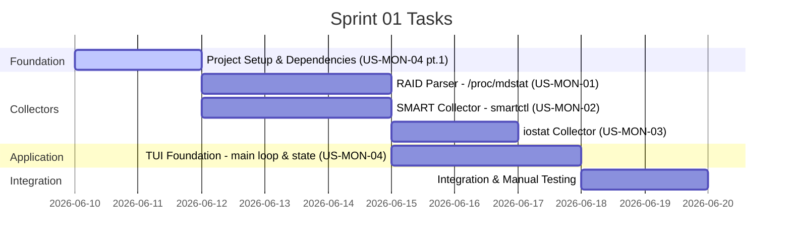

# Sprint 01: Core Data Collectors

**Goal:** พัฒนา async data collector ครบทุก data source (`/proc/mdstat`, `smartctl`, `iostat`) พร้อมโครงสร้าง TUI application พื้นฐานที่มี event loop, keyboard handling และ shared state พร้อมสำหรับต่อยอด UI ใน Sprint 02
**Timeline:** 2026-06-10 → 2026-06-24

## 📅 Internal Timeline

---

## 📋 Committed Stories & Tasks

| ID | Story / Task | Owner | Estimate (Hrs) | Status |
|:---|:---|:---|:---|:---|
| [US-MON-04](../user-stories/US-MON-04.md) | **TUI Foundation** - ตั้งค่า Cargo.toml dependencies - สร้าง tokio runtime, crossterm terminal setup - สร้าง `AppState` struct และ `Arc<Mutex<>>` sharing - Keyboard handler: `q` quit, `r` refresh | kong | 8 | 🚧 Planned |
| [US-MON-01](../user-stories/US-MON-01.md) | **RAID Status Parser** - อ่าน `/proc/mdstat` ด้วย `tokio::fs::read_to_string` - Parse array name, state, disk count - Parse rebuild %, speed, ETA ด้วย regex - Handle active / rebuilding / degraded / no-array | kong | 6 | 🚧 Planned |
| [US-MON-02](../user-stories/US-MON-02.md) | **SMART Data Collector** - รัน `smartctl -a -d scsi /dev/sdX` ด้วย `tokio::process::Command` - Parse temperature, health, serial - Parse power-on hours, grown defects, non-medium errors - Handle sudo, timeout, disk not found | kong | 8 | 🚧 Planned |
| [US-MON-03](../user-stories/US-MON-03.md) | **iostat Collector** - รัน `iostat -d -k sdc sdd sde` ด้วย async process - Parse Read/Write kB/s → MB/s per device - Handle iostat ไม่ติดตั้ง | kong | 4 | 🚧 Planned |

---

## 🛠 Sprint Specifics

### Definition of Done (DoD)

- Rust code compile ได้ไม่มี warning หรือ error (`cargo build --release`)
- `cargo clippy` ผ่านโดยไม่มี warning
- RAID parser อ่านค่าจาก `/proc/mdstat` จริงได้ถูกต้อง (ตรวจสอบด้วย `cat /proc/mdstat`)
- SMART collector ดึงอุณหภูมิและ health จาก `smartctl` ตรงกับ manual run
- iostat collector แสดง throughput ตรงกับ `iostat -d -k sdc sdd sde` manual run
- TUI application เปิด-ปิด terminal mode ได้สะอาด ไม่ทิ้ง terminal ค้าง
- Error handling ไม่ panic — ใช้ `Result`/`Option` ครบ

### Known Risks

| ความเสี่ยง | แนวทางแก้ไข |
|:---|:---|
| `smartctl` ต้องการ `sudo` | ตรวจสอบ sudoers config บน target server ก่อน; ถ้าไม่ได้ → เพิ่ม error message ชัดเจน |
| `iostat` อาจไม่ติดตั้ง | ตรวจ exit code → แสดง `N/A` แทน panic |
| Format `/proc/mdstat` อาจต่างในบางเคส | ใช้ `Option<>` สำหรับทุก field ที่อาจไม่มี |
