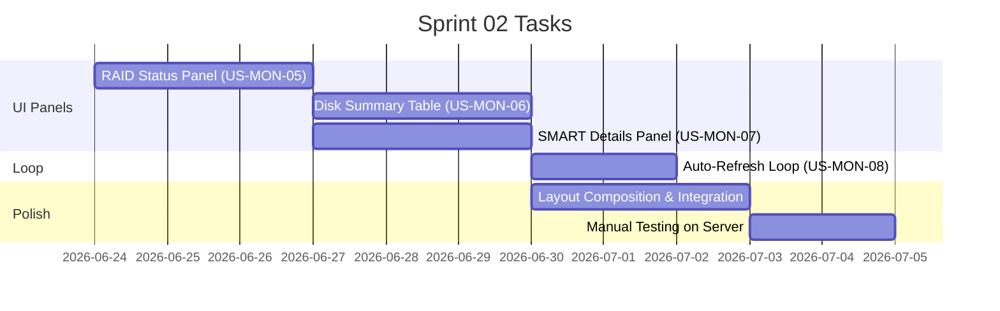

# Sprint 02: Dashboard UI

**Goal:** สร้าง ratatui dashboard ครบ 3 panels และ auto-refresh loop เพื่อให้ได้ HDD Monitor ที่ใช้งานได้จริงบน terminal
**Timeline:** 2026-06-24 → 2026-07-08

## 📅 Internal Timeline

---

## 📋 Committed Stories & Tasks

| ID | Story / Task | Owner | Estimate (Hrs) | Status |
|:---|:---|:---|:---|:---|
| [US-MON-05](../user-stories/US-MON-05.md) | **RAID Status Panel** - สร้าง `raid_panel.rs` widget - แสดง array name, state, disk count - Progress bar rebuild % - แสดง speed และ ETA | kong | 6 | ✅ Done |
| [US-MON-06](../user-stories/US-MON-06.md) | **Disk Summary Table** - สร้าง `disk_table.rs` widget - Table: Disk, Temp, Health, Read, Write, Defects - Color coding ตาม threshold - Merge ข้อมูลจาก `DiskInfo` + `IoStats` | kong | 8 | ✅ Done |
| [US-MON-07](../user-stories/US-MON-07.md) | **SMART Details Panel** - สร้าง `smart_details.rs` widget - List view: serial, hours, errors per disk - Highlight ค่าที่ผิดปกติ | kong | 4 | ✅ Done |
| [US-MON-08](../user-stories/US-MON-08.md) | **Auto-Refresh Loop** - Collector loop ทุก 2 วินาที - Render loop ทุก 250ms - Last updated timestamp - `r` key force refresh | kong | 4 | ✅ Done |
| [US-MON-12](../user-stories/US-MON-12.md) | **History Buffer & Graph UI** - เพิ่ม history ring buffers ใน AppState (VecDeque × 60 samples) - Inline Sparkline ในคอลัมน์ Temp/Read/Write ของ disk table - Sparkline RAID rebuild speed ใน RAID panel - Full Chart view (Graph View) toggle ด้วย `g` | kong | 10 | ✅ Done |
| [US-MON-13](../user-stories/US-MON-13.md) | **Panel Focus & Scroll** - `Tab`/`Shift+Tab` สลับ focus ระหว่าง panel - `↑↓`/`jk`/`PgUp`/`PgDn`/`Home`/`End` scroll focused panel - Mouse wheel scroll panel ที่เมาส์อยู่, click โฟกัส panel - Double border สำหรับ focused panel - `Scrollbar` widget ทุก panel - Status bar แสดง focus indicator - Mouse hit-testing ผ่าน `panel_rects` | kong | 8 | ✅ Done |

---

## 🛠 Sprint Specifics

### Definition of Done (DoD)

- รัน `sudo ./hdd-monitor` บน server จริง เห็น dashboard ครบ 3 panels
- ข้อมูล RAID, SMART, throughput ตรงกับ manual run ของ tools แต่ละตัว
- หน้าจออัปเดตทุก 2 วินาทีโดยไม่ flicker
- `q` ออกจากโปรแกรมสะอาด, `r` refresh ทันที
- รองรับ terminal ขนาด **100×28** (Table View) หรือ **110×30** (Graph View) หรือใหญ่กว่า
- `cargo clippy` และ `cargo test` ผ่านสะอาด
