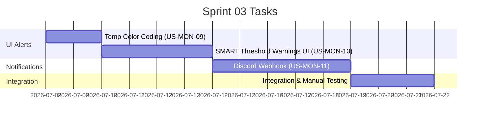

# Sprint 03: Alerts & Notifications

**Goal:** เพิ่มระบบแจ้งเตือนครบวงจร — Temperature color coding บน UI, Warning banner เมื่อ SMART threshold ถูกละเมิด และ Discord webhook สำหรับ out-of-band notification เมื่อเหตุการณ์สำคัญเกิดขึ้น
**Timeline:** 2026-07-08 → 2026-07-22

## 📅 Internal Timeline

---

## 📋 Committed Stories & Tasks

| ID | Story / Task | Owner | Estimate (Hrs) | Status |
|:---|:---|:---|:---|:---|
| [US-MON-09](../user-stories/US-MON-09.md) | **Temperature Color Coding** - เพิ่ม `WARN` suffix เมื่อ temp > 55°C ใน disk table - ตรวจสอบ sparkline + value ใช้สีตาม threshold เดียวกัน - อัปเดต Graph View temp chart Y-axis ที่ 45°C / 55°C | kong | 3 | 🔵 Planned |
| [US-MON-10](../user-stories/US-MON-10.md) | **SMART Threshold Warnings** - สร้าง `Alert` struct และ `collect_alerts()` function - เพิ่ม alert banner (1–2 rows) ใต้ header บน UI - เพิ่ม `alerts` field ใน `AppState` อัปเดตทุก collector cycle - Highlight border สีแดงบน panel ที่มี disk มีปัญหา | kong | 8 | 🔵 Planned |
| [US-MON-11](../user-stories/US-MON-11.md) | **Discord Webhook Notifications** - เพิ่ม `reqwest` dependency - สร้าง `src/notifier.rs` — `send_discord_alert()` - สร้าง config struct + TOML parser (`~/.config/hdd-monitor/config.toml`) - Alert cooldown tracker (1 ชั่วโมง per condition) - Graceful fallback เมื่อไม่มี config | kong | 10 | 🔵 Planned |

---

## 🛠 Sprint Specifics

### Definition of Done (DoD)

- Temperature ใน disk table แสดงสีตาม threshold ถูกต้อง (Green/Yellow/Red+WARN)
- Alert banner ปรากฏบน UI เมื่อ disk มี `grown_defects > 0`, `health_ok == false` หรือ `temp > 55°C`
- Discord notification ส่งถึงเมื่อ RAID degraded, temp > 60°C หรือ health fail (ทดสอบด้วย webhook จริง)
- Cooldown ทำงาน — ไม่ส่ง alert ซ้ำภายใน 1 ชั่วโมง
- โปรแกรมทำงานได้ปกติเมื่อไม่มี config file
- `cargo clippy` และ `cargo test` ผ่านสะอาด

### Known Risks

| ความเสี่ยง | แนวทางแก้ไข |
|:---|:---|
| `reqwest` เพิ่ม compile time และ binary size | ใช้ `reqwest` features เฉพาะที่จำเป็น (`json`, `rustls-tls`) |
| Discord rate limit เมื่อ alert บ่อย | cooldown 1 ชั่วโมงต่อ condition จัดการได้ |
| Alert banner ดัน layout ทำให้ min terminal height เพิ่ม | ออกแบบให้ banner ใช้ `Constraint::Max(2)` แสดงเฉพาะเมื่อมี alert จริง |
