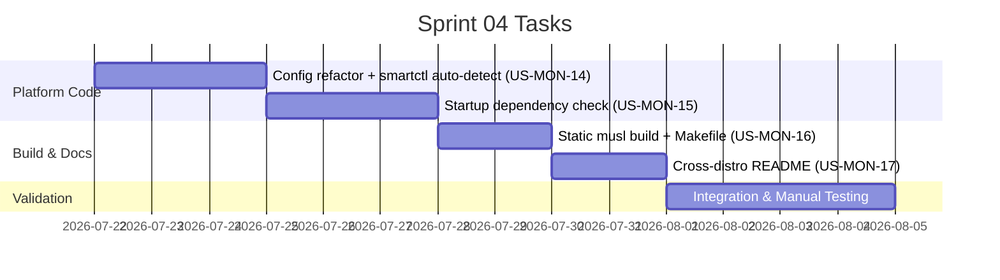

# Sprint 04: Cross-Distribution Support

**Goal:** ให้ VaultWatch รันได้บน Ubuntu/Debian, Fedora, openSUSE, Arch Linux, Alpine Linux และ Docker โดยไม่ต้อง patch code — แก้ปัญหา `sudo` hardcode, ไม่มี dependency check, Alpine musl และขาด installation docs
**Timeline:** 2026-07-22 → 2026-08-05

## 📅 Internal Timeline



---

## 📋 Committed Stories & Tasks

| ID | Story / Task | Owner | Estimate (Hrs) | Status |
|:---|:---|:---|:---|:---|
| [US-MON-14](../user-stories/US-MON-14.md) | **Configurable smartctl Privilege Escalation**<br>- สร้าง `src/config.rs` รวม `[system]` + `[discord]`<br>- Auto-detect root via `/proc/self/status`<br>- อัปเดต `smart.rs` ให้รับ cmd จาก config<br>- Refactor `notifier.rs` → ใช้ shared `config.rs` | kong | 8 | 🔵 Planned |
| [US-MON-15](../user-stories/US-MON-15.md) | **Startup Dependency Check**<br>- `check_dependencies()` ทดสอบ `smartctl --version` + `iostat -V`<br>- `detect_distro()` จาก `/etc/os-release`<br>- Error screen widget แสดง install command ตาม distro<br>- Degraded mode เมื่อ tool ขาดบางส่วน | kong | 5 | 🔵 Planned |
| [US-MON-16](../user-stories/US-MON-16.md) | **Static Binary & Alpine/Docker Support**<br>- `Makefile` (build / build-static / install / install-service)<br>- `.cargo/config.toml` สำหรับ musl target<br>- `contrib/vault-watch.service` (systemd)<br>- `contrib/vault-watch.openrc` (Alpine OpenRC) | kong | 3 | 🔵 Planned |
| [US-MON-17](../user-stories/US-MON-17.md) | **Cross-Distribution Installation Guide**<br>- `README.md` per-distro setup sections<br>- `contrib/config.example.toml` annotated<br>- Privilege setup guide (sudo/doas/setcap)<br>- Troubleshooting section | kong | 4 | 🔵 Planned |

---

## 🛠 Sprint Specifics

### Definition of Done (DoD)

- `make build-static` สร้าง binary ที่รันบน Alpine 3.19+ ได้จริง (ทดสอบใน Docker)
- VaultWatch รันบน Ubuntu 24.04, Fedora 40, Alpine 3.19 ได้โดยใช้ config ที่ถูกต้อง
- ผู้ใช้ที่ไม่ได้ติดตั้ง `smartmontools` เห็น error screen พร้อม install command ทันที
- `cargo clippy` และ `cargo test` ผ่านสะอาด
- README.md ครบถ้วน ทดสอบโดยทำตาม guide บน distro ใหม่ได้จริง

### Recommended Implementation Order

```
1. US-MON-14  →  สร้าง config.rs ก่อน (US-MON-15 ต้องใช้ config เดียวกัน)
2. US-MON-15  →  ต้องรู้ smartctl path จาก config ก่อนจะ check ได้
3. US-MON-16  →  independent, ทำหลังสุดได้
4. US-MON-17  →  เขียนหลัง code เสร็จ เพื่อ document สิ่งที่ implement จริง
```

### Known Risks

| ความเสี่ยง | แนวทางแก้ไข |
|:---|:---|
| musl + reqwest (TLS) compile ยาก | ใช้ `rustls-tls` feature ที่เลือกไว้แล้ว — ไม่ต้องการ OpenSSL |
| `cross` tool อาจต้องการ Docker | เพิ่ม native musl toolchain (`musl-tools`) เป็น fallback |
| `detect_distro()` บาง distro ไม่มี `/etc/os-release` | Fallback แสดง generic hint แทน — ไม่ crash |
| Config refactor อาจ break notifier | เขียน unit test ครอบ `load_config()` ก่อน refactor |
