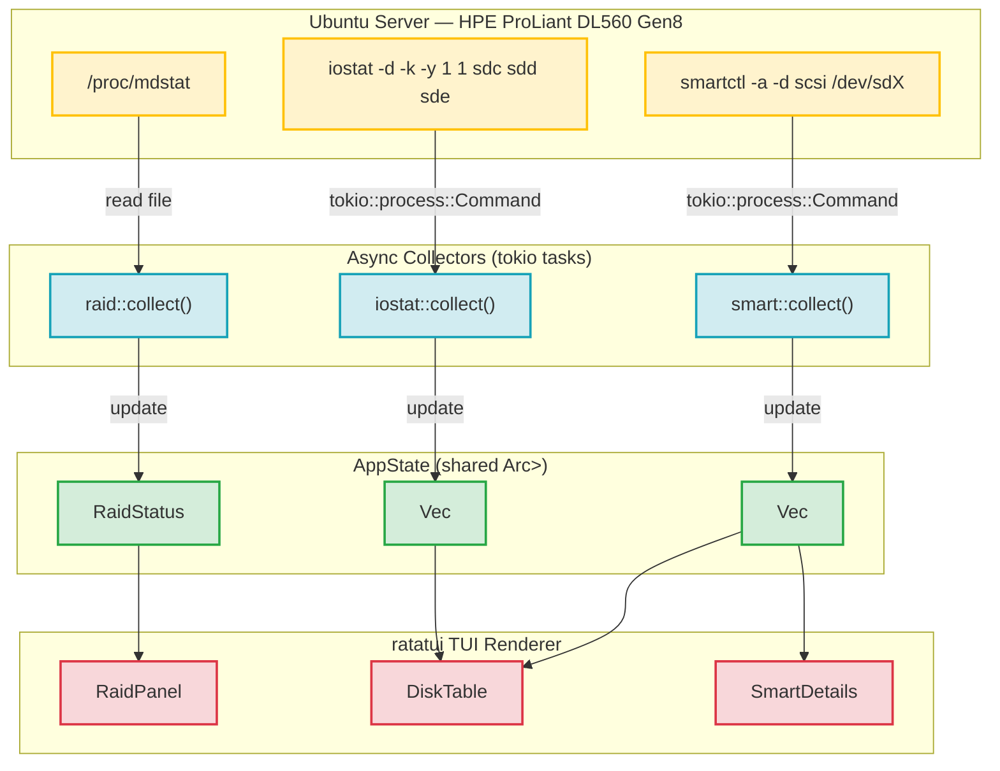
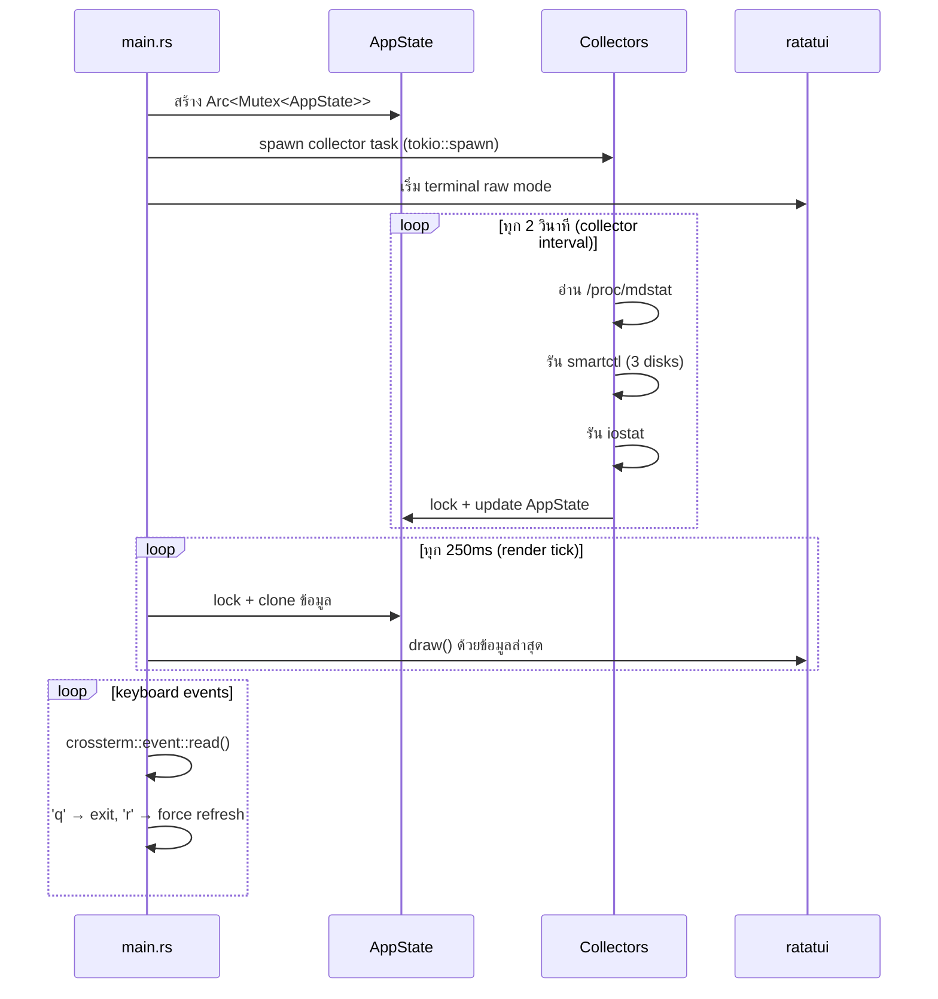

# HDD Monitor — System Architecture

**Version:** 1.0.0 | **Last Updated:** 2026-06-10

---

## 1. ภาพรวมสถาปัตยกรรม

HDD Monitor เป็น TUI (Terminal User Interface) application ที่ทำงานด้วย Rust บน Ubuntu Server ออกแบบมาเพื่อตรวจสอบ SAS HDD, mdadm RAID และ SMART health แบบ realtime โดยไม่ต้องพึ่งพาเครื่องมือ monitoring ทั่วไปที่ไม่รองรับ SAS disk หรือ physical disk ที่อยู่หลัง LVM

ปัญหาหลักของเครื่องมือมาตรฐาน (`glances`, `bottom`) คือแสดงเฉพาะ mounted filesystem (`/dev/dm-0`, `/dev/sda`) แต่ไม่เห็น physical SAS disk (`sdc`, `sdd`, `sde`) และไม่ดึงอุณหภูมิจาก `smartctl` ซึ่งเป็น source of truth สำหรับ SAS drive



---

## 2. โครงสร้าง Module

```
src/
├── main.rs                 # Entry point — tokio runtime, event loop, terminal setup
├── app.rs                  # AppState struct, tick handler, shared state management
├── ui.rs                   # ratatui layout composition — ประกอบ widget ทั้งหมด
├── collectors/
│   ├── mod.rs              # pub use + shared types (CollectorError)
│   ├── raid.rs             # /proc/mdstat parser → RaidStatus
│   ├── smart.rs            # smartctl runner + SCSI output parser → Vec<DiskInfo>
│   └── iostat.rs           # iostat runner + output parser → Vec<IoStats>
└── widgets/
    ├── mod.rs              # pub use
    ├── raid_panel.rs       # RAID status widget (Block + Paragraph + Gauge)
    ├── disk_table.rs       # Disk summary table widget (Table + Row + Sparkline)
    ├── smart_details.rs    # SMART details widget (List/Paragraph)
    ├── graph_view.rs       # Graph View widget (Chart + Dataset) — toggle ด้วย g
    └── sparkline_cell.rs   # Helper: Sparkline + value ภายใน Table Cell
```

---

## 3. Async Data Flow

ระบบใช้ `tokio` ทำงานแบบ async โดยมี collector loop แยกกับ event loop



---

## 4. Target Disk Configuration

ระบบออกแบบมาสำหรับ server ที่มี configuration ดังนี้:

| Component | Spec |
| :--- | :--- |
| HBA | LSI SAS2308 IT Mode |
| Disks | HP MB6000JVYZD 6TB SAS × 3 (`sdc`, `sdd`, `sde`) |
| RAID | mdadm RAID10 → `md0` |
| Volume | LVM `vg_raid/lv_data` |
| Filesystem | ext4 → `/media/storage-one` |

Disk list เป็น **configurable** ผ่าน const ใน `app.rs` เพื่อรองรับ setup ที่ต่างออกไป

---

## 5. Design Constraints

| ข้อกำหนด | เหตุผล |
| :--- | :--- |
| ใช้ `smartctl` เป็น SMART data source | `lm-sensors` + `drivetemp` ไม่เห็น SAS disk ทั้งหมด — `smartctl -d scsi` เป็น source of truth เดียวที่เชื่อถือได้ |
| ไม่แสดง mounted filesystem | ออกแบบเพื่อ physical disk monitoring โดยเฉพาะ ไม่แทน `glances` |
| `tokio::process::Command` สำหรับ external tools | ป้องกัน blocking บน TUI render loop |
| `Arc<Mutex<AppState>>` สำหรับ shared state | Collector task และ render task อยู่คนละ thread |

---

## Related Documents

- รายละเอียด data structures และ parser specs: [01-system-design.md](./01-system-design.md)
- Product backlog: [agile/01-product-backlog.md](../agile/01-product-backlog.md)
